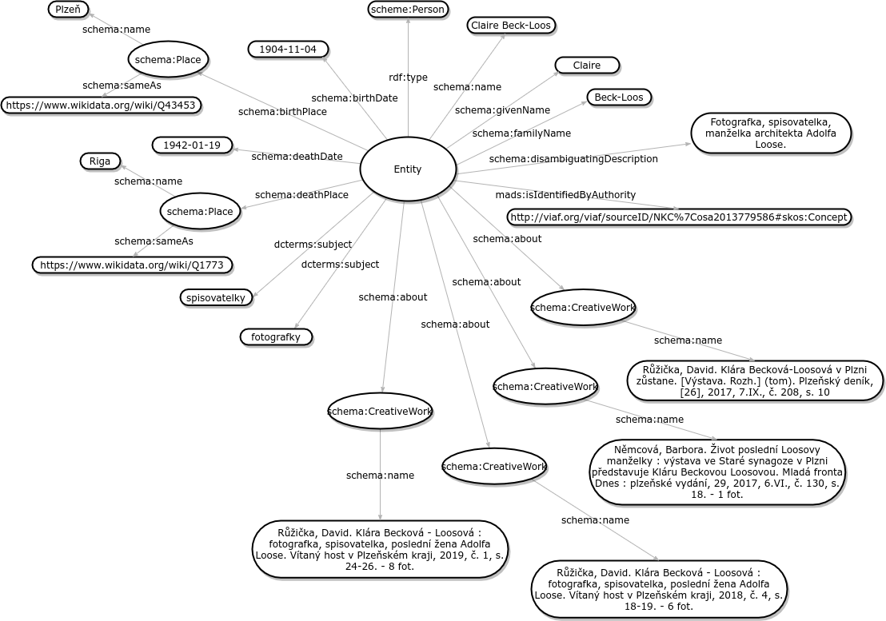

# ETL Worshop SVKPK

## Overview

## Entity types

### Person

| Field name         | RDF property                     | Expected value       | Source MARC field |
| ------------------ | -------------------------------- | -------------------- | ----------------- |
| Type               | rdf:type                         | schema:Person        |                   |
| Name               | schema:name                      | Literal              | 100a              |
| Given name         | schema:givenName                 | Literal              | 100a              |
| Family name        | schema:familyName                | Literal              | 100a              |
| Birth date         | schema:birthDate                 | Literal              | KDNa              |
| Birth place        | schema:birthPlace                | schema:Place         | R02               |
| Death date         | schema:deathDate                 | Literal              | KDUa              |
| Death place        | schema:deathPlace                | schema:Place         | R03               |
| Description        | schema:disambiguatingDescription | Literal              | 678a              |
| Works about person | schema:about                     | schema:Creative Work | 670a              |
| Keywords           | dcterms:subject                  | Literal              | R06a              |
| Authority ID       | mads:isIdentifiedByAutority      | URI                  | 100/7             |

### Place

| Field name   | RDF property            | Expected value | Source MARC field |
| ------------ | ----------------------- | -------------- | ----------------- |
| Type         | rdf:type                | schema:Place   |                   |
| Name         | schema:name             | Literal        | R02/R03m          |
| Contained in | schema:containedInPlace | Literal        | R02/R03o          |
| Same as      | schema:sameAs           | URI            |                   |

### Creative Work

| Field name | RDF property | Expected value      | Source MARC field |
| ---------- | ------------ | ------------------- | ----------------- |
| Type       | rdf:type     | schema:CreativeWork |                   |
| Name       | schema:name  | Literal             | 670a              |

## How to

1. Import `data/svkpk-workshop-pipeline.jsonld` to ETL running on `localhost:8080`
2. Create `svkpk` dataset in Fuseki running on `localhost:3030`
3. Execute pipeline
4. Make sure that data has been loaded to Fuseki with `SELECT * WHERE { GRAPH ?g{ ?s ?p ?o}} LIMIT 10`
5. Import `data/silk-project.zip` to SILK running on `localhost:8888`
6. Open _Linking Task_ and _Generate Links_
7. Execute task
8. Validate changes in Fuseki dataset with `SELECT * WHERE { GRAPH ?g {?s owl:sameAs ?o}} LIMIT 10`
